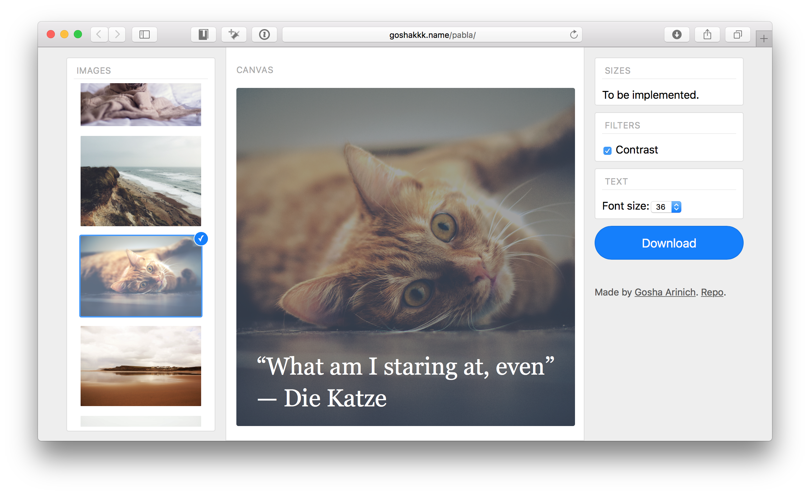

# Pabla

[Pabla](http://goshakkk.name/pabla/) is a child of a copycat and Buffer's amazing [Pablo](https://pablo.buffer.com/app).
It lets you compose engaging images for social networks.

This repo is mainly a playground for experimenting with using React to render to [canvas](https://developer.mozilla.org/en-US/docs/Web/API/Canvas_API) in a declarative fashion.

If you are interested in how I made it work, I have [a blog post](http://goshakkk.name/react-custom-renderers/) explaining just that.

### License

Copyright 2016 Gosha Arinich.

All rights reserved.

Commercial and other use is not permitted, the source code is for educational purposes only.
